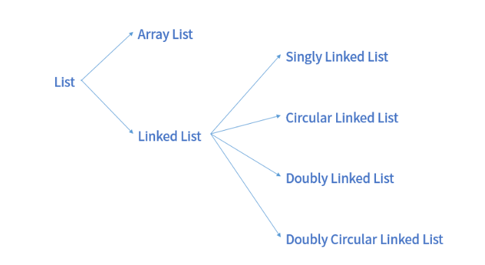

#### Array 란?
연관된 데이터를 메모리상 연속적이며, 순차적 그리고 미리 할당된 크기 만큼 저장하는 자료구조이다.  
Array의 특징은 저장공간이 고정되어 있으며, 데이터가 순처작으로 저장되어 있다.  
Array에는 저장된 데이터마다 인덱스 값을 가지고 있어, 탐색시 O(1)의 시간으로 탐색이 가능하지만 삽입, 삭제 시에는 O(n)의 시간이 필요하다.

#### List 란?
리스트는 순차적으로 데이터가 담겨있으며, 중복 데이터 저장이 가능한 자료 구조이다.  
스택, 큐, 덱과 같은 선형 자료구조가 대표적인 예시이다.  
구현 방법에 따라 순차 리스트와 연결 리스트로 나뉘며, 순차 리스트의 대표적인 예시는 배열이다.
  
List는 다시 순차 리스트, 연결 리스트로 나뉘며 연결 리스트에는 단일, 원형, 이중 연결 리스트가 존재한다.  

#### 순차리스트  
자료들을 순차적인 메모리 공간 안에 연속하여 저장하는 자료 구조(보통 배열을 의미)  
보통 Array와 같은 취급을 받지만, 자바에서는 Array List라는 별도 자료구조가 존재한다.  

#### 연결 리스트
연결리스트는 Array와 다르게 메모리 상에서 데이터가 비연속적으로 저장된다.  
메모리상 연속적인 주소를 가지고 있어야하는 Array의 특징상 고정된 메모리 크기를 가지고 있지만,  
비연속적인 데이터 저장형태를 가지는 연결 리스트는 메모리 크기를 동적으로 가질 수 있다.  
연결 리스트는 노드라는 개념을 가지고, 각 노드는 데이터와 다음 노드의 주소를 가지고 있다.  
Array와 다르게 고정된 크기를 갖고 있지 않으며, 배열과 달리 인덱스를 갖고 있지 않기 때문에 조회시 모든 노드를 순회해야한다.  
삽입, 삭제시에도 O(N)의 시간 복잡도를 가진다

#### 단순 연결 리스트(Singly Linked List)
#### 원형 연결 리스트(Circular Linked List)
#### 이중 연결 리스트(Doubly Linked List)
#### Java의 ArrayList와 Array의 차이
java에는 ArrayList 이름의 자료구조가 존재한다.  
ArrayList는 Array와 List의 특징을 섞어서 가지고 있는 자료 구조이다.  
내부적으로 데이터를 저장할때 Array를 이용하고 있으며, Array와 달리 가변적인 크기를 가질 수 있다.(List의 특징)  

ArrayList 생성시 default size로 생성되며, 해당 size를 넘게 될 경우 기존 사이즈를 기반으로 새로운 size를 가진 배열을 생성한다.  
생성된 배열에 기존 배열 데이터를 복사한후, 기존 배열은 삭제한다.  

내부적으로 Array를 사용하기에 데이터를 빠르게 읽고, 쓸 수 있지만 요소를 중간에 삽입하거나 삭제할 때 성능이 좋지 않을 수 있다.  

#### Java CopyOnWriteArrayList란?